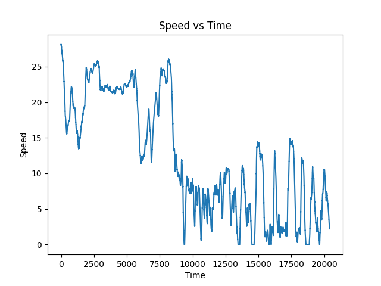
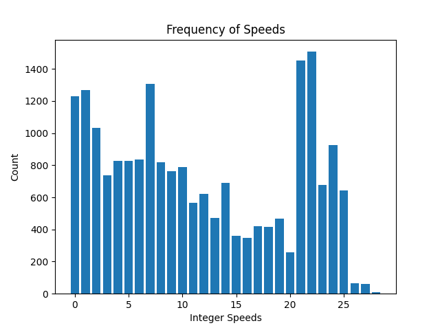
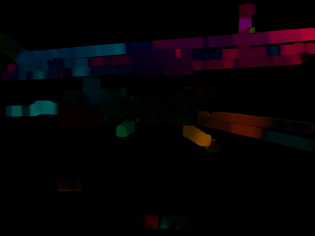
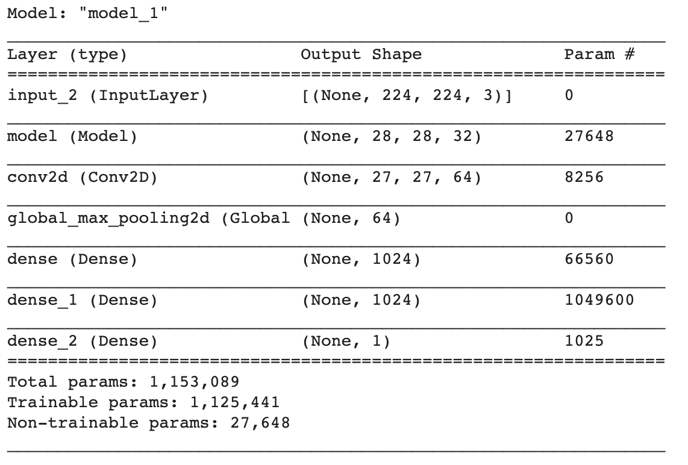
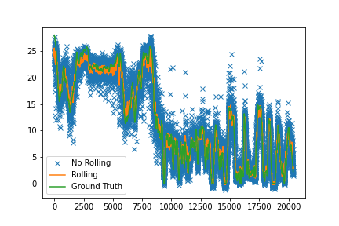
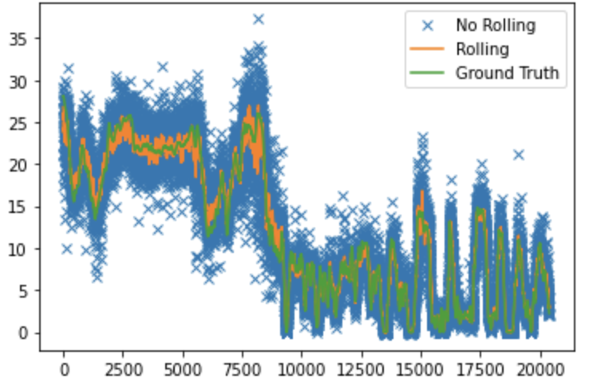
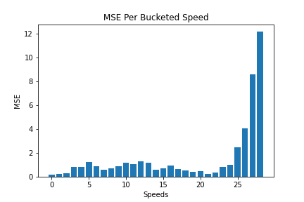
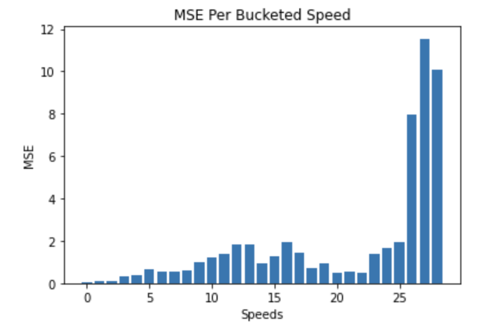
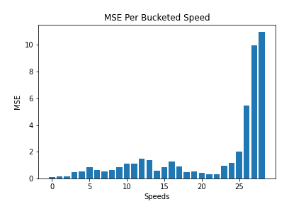
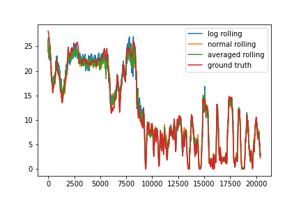

# comma-speedchallenge
This is my attempt at the comma.ai Speed Challenge. Here is my brief overview of my approach and results.

## Background
As illustrated by [Ryan](https://github.com/ryanchesler/comma-speed-challenge), there are many different approaches to this problem. Optical flow and LSTMs seem to be a common approach. Many of the models seem to overfit, due to lack of training data (there's only 20400) frames in total, so training a model from scratch doesn't seem very feasible. A good alternative is to utilize [transfer learning](https://cs231n.github.io/transfer-learning/).

The training video contains 20400 frames with corresponding speeds for each frame. The test video contains 10798 frames. Both videos contain a mixture of highway and residential driving.

The first half (or so) is the highway driving where the next is the residential driving (with stops and traffic). 

One obvious thing that sticks out to me is that the frequency of speeds above 25 is very, very low. We will probably have a hard time predicting speeds above 25 if we don't have enough examples.

### Optical Flow
[Optical Flow](https://en.wikipedia.org/wiki/Optical_flow) is a computer vision technique used to delineate the apparent motion between two images by comparing the movement of points between two images. It has many applications to [self-driving](https://nanonets.com/blog/optical-flow/) and even has been used in some [reinforcement learning](https://arxiv.org/pdf/1901.03162.pdf).  

### Transfer Learning
Transfer learning has been shown to be a great tool for domain transfers by utilizing the generic features extracted from a CNN trained on [imagenet](https://arxiv.org/abs/1403.6382). Transfer learning is especially important in settings where we may not have enough data and we can leverage the training of other models so we don't have to do all the hard work (i.e. train a model for weeks).

## Approach
My approach was to use optical flow from two consecutive frames to predict the mean speed between the two frames. Instead of applying the optical flow on the raw images, I first applied a Canny Edge Detector, in an attempt to filter out the noise and hopefully pick up some useful information (such as the lane markings). Given that the speed doesn't change very quickly between frames, the mean seems appropriate here. These frames would be fed into a pretrained CNN which would predict the speed of the frames.  

We also applied random augmentations (brightness and hue) as way to combat overfitting.
We trained two models: one to predict the log speed and one to predict the regular speed

### Architecture
The architecture that I used is shown below, where model is MobileNet. I took the first 37 layers and used those as a fixed feature extractor. I used Adam optimizer (lr=3e-4) and L2 regularization(.01). 

### Things That Make this Problem Hard!
One of the first thing that I noticed that I thought would be challenging was scarcity of data. Like I stated above, since we don't have tons of data, we need to be smart about augmentation and making sure that we don't totally overfit.

Another thing that jumped out at me was the distribution of speeds. It didn't appear to follow any distribution, at least one that I know of (excuse my poor probability skills). One thing that especially stood out to me about this was the lack of examples where the speed was greater than 25. There are very few examples and it seemed unlikely we would ever predict that speed well.

## Results
After predicting, since the variance of the speed frame to frame can't be incredibly different, we apply an EMA to smooth the predictions. This allows our predictions to have a little more error when predicting. We use a window size of 10 as that showed the greatest performance on the training set.  

<table>
<tr>
    <td> 
    <td> 
</tr>
<tr>
    <td> 
Normal Predictions

    <td> 
Log Predictions

</tr>
</table>

One thing that stood out to me was that the normal predictions had a much tighter band around higher speeds, whereas the log predictions had a much tighter band of predictions around the lower speeds. Knowing this, I thought maybe averaging the predictions of the two models would help increase the performance. 

Here are the errors per bucketed speed on the training set.

<table>
<tr>
    <td> 
    <td> 
</tr>
<tr>
    <td> 
Normal Predictions

    <td> 
Log Predictions

</tr>
<tr>
  <td> 
  <td> 
</tr>
<tr>
    <td> 
Averaged Predictions

    <td> 
Predicted Speed vs Time

</tr>
</table>

### Things I Tried (and Failed)
* Offline Data Augmentation
    * I tried manually increasing the data size by performing different data augmentation techniques (brightness, hue, zoom, flip, etc.) but results never were good.
    * Remember when doing this to not introduce data leakage! (Split train and validation before augmentation)
* Using the full network as feature extractor
    * Since the data is so much different than ImageNet, this wasn't going to work well

## Next Steps
Many people have talked about using LSTMs and this seems like an appropriate approach.

One thing I would have liked to try is how well different networks work, whether they are other networks trained on ImageNet or Optical Flow networks, such as [FlowNet](https://paperswithcode.com/paper/flownet-20-evolution-of-optical-flow).

Additionally, semantic segmentation seems to be another popular suggestion of things to try more. I would be interested to see if using a pretrained Pix2Pix implementation on Cityscapes, you could extract only the road of the lane and then calculate the flow of the masked image.
## Conclusion
After smoothing and averaging, we were able to achieve a .81 MSE on the training set. We tried to combat overfitting through augmentation and L2 weight regularization, but there is certainly a possibility we still overfit, given the unique distribution of speeds.  

Transfer learning is an incredible tool, but learning how to [augment](https://towardsdatascience.com/when-conventional-wisdom-fails-revisiting-data-augmentation-for-self-driving-cars-4831998c5509) data to better suit your problem is important as well!
